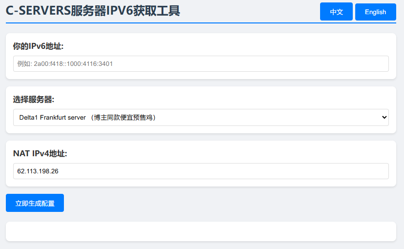

# C-SERVERS IPv6 NAT Toolkit

[](LICENSE)


English | [中文文档](README.md)

## 🚀 Live Demo
👉 **[Try it now!](http://cs-ipv6-nat-toolkit.github.pcbbs.net/)** 👈

## 🚀 Key Features
- **Smart Port Calculator**  
  Automatically calculates TCP/UDP port ranges based on IPv6 hexadecimal values
- **Dual-Stack Forwarding**  
  Generates ready-to-use commands for:
  - IPv4→IPv6 TCP/UDP forwarding
  - IPv6→IPv4 TCP/UDP forwarding
- **Server Presets**  
  Pre-configured Delta1 Frankfurt server (NAT IP: 62.113.198.26)
- **Enterprise Ready**  
  Auto-generates systemd service configurations
- **Multi-Language UI**  
  Chinese/English language switching

## 💻 Quick Start
```bash
git clone https://github.com/k08255-lxm/cs-ipv6-nat-toolkit.git
cd cs-ipv6-nat-toolkit
# Open index.html in your browser
```

## 📘 Detailed Usage
### Step 1: Input IPv6 Address
Supports both formats:
- Full format: `2a00:f48:1000:416:0000:0000:0000:5401`
- Shortened format: `2a00:f48:1000:416::5401`

### Step 2: Select Server
| Option | Description |
|--------|-------------|
| Delta1 Frankfurt | Auto-fill predefined NAT IP |
| Custom Server | Manually input other NAT IP |

### Step 3: Get Configuration
Generated output includes:
```bash
# Port Ranges
TCP: 225040-225049
UDP: 121800-121804

# Sample Command (auto-filled)
socat TCP4-LISTEN:225040,reuseaddr,fork TCP6:[2a00:f48:1000:416::5401]:225040

# Persistence Setup
sudo systemctl enable socat-225040
```

## 🧑💻 Developer Guide
### Project Structure
```
cs-ipv6-nat-toolkit/
├── index.html          # Core logic
├── LICENSE             # License file
├── README.md           # Chinese docs
├── README_en.md        # English docs
└── docs/               # Documentation
    └── preview.png     # UI preview
```

### Contribution
We welcome contributions through:
1. Submitting issues
2. Developing features in forked repos
3. Creating pull requests

## 🙏 Acknowledgments
This tool is developed with assistance from [DeepSeek](https://www.deepseek.com) AI

## 🔌 Supported Providers
[](https://c-servers.co.uk)

## 📜 License
MIT Licensed - See [LICENSE](LICENSE)

## 🖼️ UI Preview

