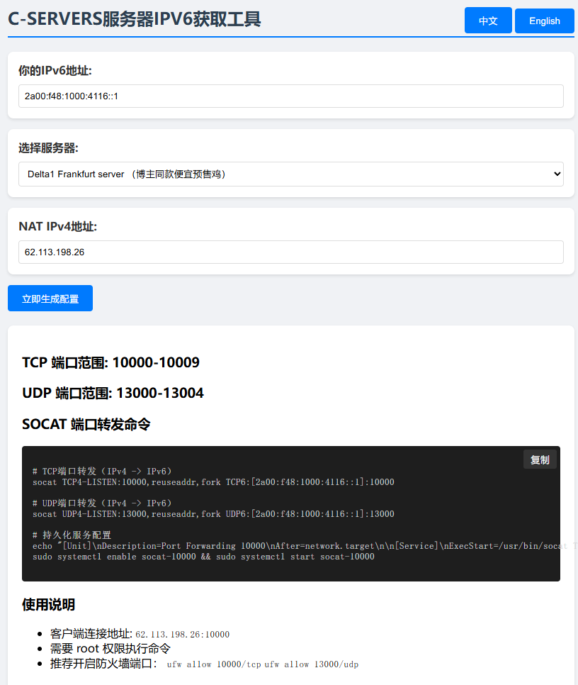

# C-SERVERS IPv6 NAT Toolkit

[](LICENSE)


English | [中文文档](README.md)

## 🚀 Live Demo
👉 **[Try it now!](http://cs-ipv6-nat-toolkit.github.pcbbs.net/)** 👈

## 🚀 Key Features
- **Smart Port Calculator**  
  Auto-calculates TCP/UDP port ranges based on IPv6 hexadecimal values
- **Dual-Stack Forwarding**  
  Generates ready-to-use socat commands for:
  - IPv4→IPv6 TCP/UDP forwarding
  - IPv6→IPv4 TCP/UDP forwarding
- **Server Presets**  
  Pre-configured Delta1 Frankfurt server (NAT IP: 62.113.198.26)
- **Enterprise Ready**  
  Auto-generates systemd service configurations
- **Multi-Language UI**  
  Chinese/English language switching

## 💻 Quick Start
### 1. Install Dependencies
#### Install socat
Choose command based on your OS:

```bash
# CentOS/RHEL
sudo yum install -y socat

# Ubuntu/Debian
sudo apt-get update && sudo apt-get install -y socat

# Alpine Linux
sudo apk add socat
```

#### Verify Installation
```bash
socat -V
# Should display e.g. socat version 1.7.4.0
```

### 2. Use the Tool
#### Online Version
Visit [Live Demo](http://cs-ipv6-nat-toolkit.github.pcbbs.net/)

#### Local Version
```bash
git clone https://github.com/k08255-lxm/cs-ipv6-nat-toolkit.git
cd cs-ipv6-nat-toolkit
# Open index.html in browser
```

### 3. Run Forwarding
Example commands (replace with generated ports):
```bash
# TCP forwarding
socat TCP4-LISTEN:10000,reuseaddr,fork TCP6:[2a00:f48:1000:416::11]:10000

# UDP forwarding
socat UDP4-LISTEN:13000,reuseaddr,fork UDP6:[2a00:f48:1000:416::11]:13000
```

### 4. Persistence Setup (Recommended)
```bash
# Create systemd service
sudo tee /etc/systemd/system/socat-10000.service <<EOF
[Unit]
Description=Socat Port Forwarding (TCP 10000)
After=network.target

[Service]
ExecStart=/usr/bin/socat TCP4-LISTEN:10000,reuseaddr,fork TCP6:[2a00:f48:1000:416::11]:10000
Restart=always

[Install]
WantedBy=multi-user.target
EOF

# Enable service
sudo systemctl enable socat-10000
sudo systemctl start socat-10000
```

### 5. Firewall Configuration
```bash
# Allow TCP port
sudo ufw allow 10000/tcp

# Allow UDP port
sudo ufw allow 13000/udp

# Check rules
sudo ufw status
```

## 📘 Detailed Usage
### Step 1: Input IPv6 Address
Supported formats:
- Full format: `2a00:f48:1000:416:0000:0000:0000:5401`
- Shortened format: `2a00:f48:1000:416::5401`

### Step 2: Select Server
| Option | Description |
|--------|-------------|
| Delta1 Frankfurt | Auto-fill NAT IP (62.113.198.26) |
| Custom Server | Manual NAT IP input |

### Step 3: Get Configuration
Generated output includes:
```bash
# Port Ranges
TCP: 225040-225049
UDP: 121800-121804

# Sample Command (auto-filled)
socat TCP4-LISTEN:225040,reuseaddr,fork TCP6:[2a00:f48:1000:416::5401]:225040

# Persistence Command
sudo systemctl enable socat-225040
```

## 🛠️ Troubleshooting
### Common Issues
#### "socat: command not found"
- Verify socat installation
- Re-run installation commands

#### "Address already in use"
```bash
# Find process
sudo lsof -i :10000

# Kill process
sudo kill -9 <PID>
```

#### "Permission denied"
- Run with root privileges
```bash
sudo socat ...
```

## 🧑💻 Developer Guide
### Project Structure
```
cs-ipv6-nat-toolkit/
├── index.html          # Core logic
├── LICENSE             # License file
├── README.md           # Chinese docs
├── README_en.md        # English docs
└── docs/               # Documentation
    └── preview.png     # UI preview
```

### Contribution
We welcome contributions through:
1. Submitting issues
2. Developing features in forked repos
3. Creating pull requests

## 🙏 Acknowledgments
This tool is developed with assistance from [DeepSeek](https://www.deepseek.com) AI

## 🔌 Supported Providers
[](https://c-servers.co.uk)

## 📜 License
MIT Licensed - See [LICENSE](LICENSE)

## 🖼️ UI Preview

